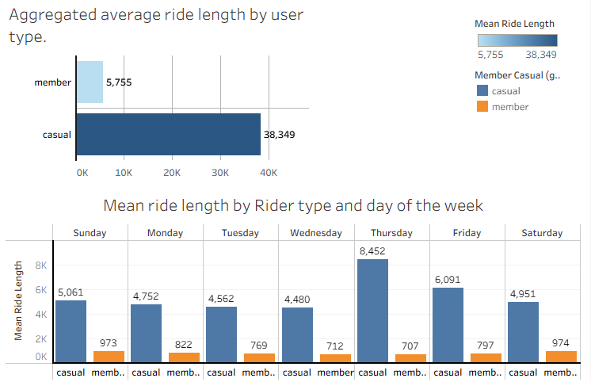

------------------------------------------------------------------------

# Cyclistic Bike-Share: Casual vs. Member Usage Analysis

### 1. Business Task

Cyclistic’s marketing team wants to **increase the number of annual members**.\
To support this goal, we need to:

-   Understand **how casual riders and annual members use Cyclistic bikes differently**.\
-   Use those differences to design **targeted marketing strategies** that convert casual riders into annual members.

**Key question:**\
\> How do casual riders and annual members differ in their riding behavior, and how can Cyclistic leverage those differences to drive more annual memberships?

------------------------------------------------------------------------

### 2. Data Sources

This analysis uses **aggregated and cleaned data** derived from the public Cyclistic (Divvy) bike-share trip data provided by **Motivate International Inc.**:

-   **Original source:** Divvy / Cyclistic trip data under the data license: 👉 

-   **Working data-set in this project:** 👉 [data-set](cyclistic_mean_ride_length_full_dataframe.csv) 

-   **Fields used in this analysis:**

    -   `member_casual` – rider type (`casual` vs `member`)
    -   `day_of_week` – day of the week (`Sunday` … `Saturday`)
    -   `mean_ride_length` – mean ride length per group (string with comma as thousands separator)
    -   `mean_ride_length_min` – same metric converted to numeric minutes (created in this notebook)

The file cyclistic_mean_ride_length_full_dataframe.csv is an **aggregated summary** that contains the **average ride duration** by rider type and day of week.

------------------------------------------------------------------------

### 3. Data Cleaning / Transformation

All heavy data cleaning is demonstrated in the link below using Rmarkdown coding language for your review

👉 [data_cleaning](data_cleaning.R)

------------------------------------------------------------------------

### 4. Summary of Analysis

#### 4.1. Average ride length by day and rider type

A visualization of the mean ride length in minutes by day of week and rider type: [Tableau generated dashboard] 👇

#### 4.2. Key patterns

Using this aggregated summary, we observe:

-   **Casual riders consistently have much longer average ride durations** than members on every day of the week.
-   The **gap between casual and member ride length** is large and persistent:
    -   Casual riders appear to use bikes for **longer, possibly leisure-oriented** rides.
    -   Members have **shorter, more regular rides**, consistent with **commuting or routine utilitarian trips**.
-   Ride lengths for both groups tend to be **higher on weekends** (especially Sunday), but the **difference is magnified for casuals**:
    -   This reinforces the idea that casual riders often ride for **recreation and tourism**, especially on weekends.
    -   Members ride more **consistently across the week**, likely for everyday transportation.

Even with only aggregated data by day and average duration, the behavioral segmentation is clear: - Casual = longer, weekend and leisure-oriented - Member = shorter, consistent, practical

------------------------------------------------------------------------

### 5. Supporting Visualizations & Insights

#### 5.1 Bar chart: Average ride length by day & rider type

As shown in the figure above:

**Insights from the chart:**

-   **Casual riders**:
    -   Longest average rides on **weekends**, especially **Sunday**.
    -   Likely to be tourists, occasional riders, or people using bikes for fun/outings.
-   **Members**:
    -   Much **shorter average rides** across all days.
    -   Patterns are consistent with **work commutes, errands, and daily mobility**.

This strongly suggests **different use cases**: - Members value reliability, speed, and everyday utility. - Casual riders value experience, flexibility, and leisure.

------------------------------------------------------------------------

### 6. Top 3 Recommendations

Based on the analysis, here are three concrete recommendations to **convert casual riders into annual members**:

#### 6.1. Weekend leisure → Membership bundles

Design membership offerings that appeal directly to casual riders’ **weekend and leisure behavior**:

-   Offer a **“Weekender Membership”** or **flexible low-commitment membership** with:
    -   Lower-cost monthly or seasonal pass
    -   Emphasis on unlimited or heavily discounted **longer rides on weekends**
-   Promote these plans via:
    -   In-app prompts for casual riders taking long weekend rides
    -   Signage at high-tourism or park stations

**Rationale:** Casual riders already show a strong tendency for longer, weekend rides. A tailored membership that fits that pattern reduces friction for “upgrading” their current behavior.

------------------------------------------------------------------------

#### 6.2. Show the value of membership vs repeat casual use

Target **frequent casual riders with long rides** and demonstrate **cost savings and convenience** of becoming a member:

-   Use **trip history** (in the full dataset) to identify:
    -   Riders with multiple long casual trips per month
-   Trigger:
    -   Personalized emails or in-app messages comparing:
        -   Their recent spending as a casual rider
        -   What they *would have spent* as an annual member
-   Emphasize:
    -   **Savings** on long rides
    -   **No need to think about per-ride pricing** on weekends or holidays

**Rationale:** For casual users already behaving like light members, framing membership as an obvious financial win can push conversion.

------------------------------------------------------------------------

#### 6.3. Experience-focused marketing for casual riders

Position membership as a **better leisure experience**, not just a commuter product:

-   Promote:
    -   **Curated ride routes** (lakeshore, parks, neighborhoods)
    -   Partnerships with **local attractions, coffee shops, and events** offering discounts to members
    -   “Member-only ride days” or “guided rides” on weekends
-   Messaging:
    -   “Ride more, explore more, worry less about time or cost.”
    -   Visuals that show **friends/families on long weekend rides**, not only solo commuters.

**Rationale:** Since casual riders clearly use bikes for enjoyment and exploration, framing membership as a **lifestyle upgrade** (not just a cheaper commute) aligns with their primary use case.

------------------------------------------------------------------------

### 7. How to Reproduce (R)

Below is a **template R workflow** that recreates the logic behind this project using the full raw Cyclistic data. **👉** [work-flow](data_cleaning.R)
